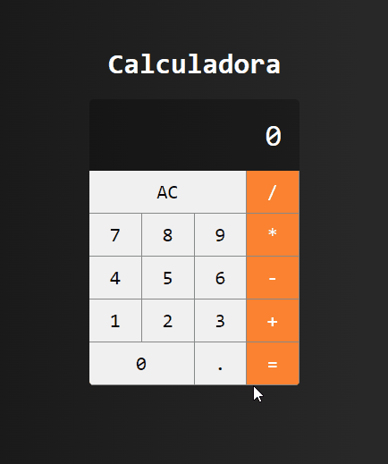

# Introdução ao Create React App

Este projeto foi iniciado com [Create React App](https://github.com/facebook/create-react-app).

## Scripts Disponíveis

No diretório do projeto, você pode executar:

### `npm start`

Executa o aplicativo no modo de desenvolvimento.
Abra [http://localhost:3000](http://localhost:3000) para visualizá-lo em seu navegador.

## Calculadora:

  

